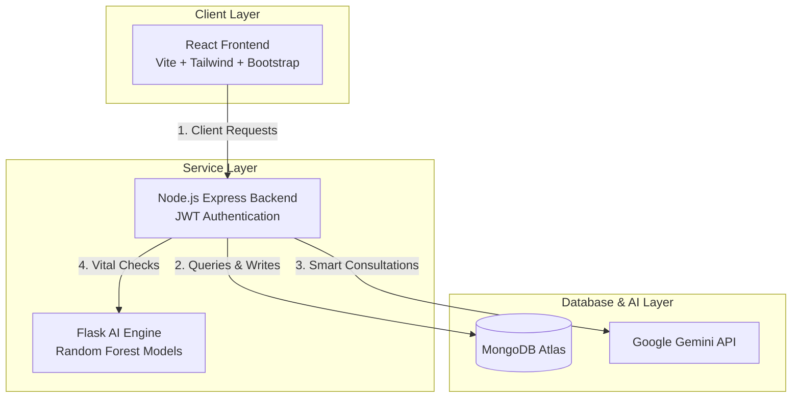

# 🏥 HospCare: Smart Hospital Management & AI-Powered Diagnosis System

<p align="center">
  
  
  
  
  
  
  
  
</p>

HospCare is a modern, comprehensive, and intelligent Hospital Management System. It connects patients, doctors, and hospital administrators in a unified platform, utilizing Machine Learning and Generative AI to provide automated diagnostic assistance, medicine prescription predictions, and seamless appointment scheduling.

---

## 📸 Architecture & Data Flow

Below is the layout of how the frontend, backend, database, and machine learning components communicate with one another:



---

## 🚀 Key Features

### 💻 Frontend (React SPA)
*   **👤 Intuitive Patient Portal**: Check medical records, fill symptoms logs, book consultations, and view real-time feedback.
*   **🩺 Doctor Dashboard**: View scheduled appointments, review patient records, and submit treatments and prescriptions.
*   **💬 AI Medical Chatbot**: A premium glassmorphic chatbot supporting natural **Hinglish** and English symptoms checkers.
*   **🎨 Dynamic Light & Dark Modes**: Complete global CSS variables theme switching system with state saved in `localStorage`.
*   **⏳ Shimmer Loaders & Empty States**: Polished loading placeholder states and descriptive custom illustration alerts for search mismatches.
*   **📊 Analytics & Visualizations**: Dynamic health tracking, vitals charts, and metrics utilizing Chart.js and Recharts.
*   **✨ Smooth UX/UI**: Animated transitions powered by Framer Motion and a responsive interface designed using a blend of Bootstrap and Tailwind CSS.

### 🛡️ Backend REST API (Node.js + Express)
*   **🔑 Secure Authentication**: JWT-based user session management with password hashing via Bcrypt.
*   **🛡️ Clinical Safety Overrides**: Deterministic guardrails matching symptom/disease identification to verified prescriptions for complete accuracy.
*   **🧠 Gemini AI Integration**: Powered by `@google/generative-ai` for intelligent medical responses and advice.
*   **✉️ Email Notifications**: Automatic appointment booking confirmations and medical notifications using Nodemailer.
*   **🗄️ Structured Schemas**: Data models for Users (Patients/Doctors), Hospitals, Districts, States, Appointments, and Alerts.

### 🤖 AI/ML Engine (Python + Flask)
*   **💊 Prescription Prediction Model**: A Random Forest classifier predicting optimal medications, dosage, route, and frequency based on 30+ patient vital parameters and symptom inputs.
*   **🎯 High Accuracy**: 100% accuracy on medicine prediction and 99.9% on frequency.
*   **🔬 Interactive Web Client**: A testing client (`api_client.html`) to test prediction queries outside the main app.

---

## 📂 Project Structure

```text
HospCare/
├── AI/ML/                                  # Machine Learning components
│   ├── medicine_prescription_predictor.py  # Model training script
│   ├── medicine_prediction_flask_api.py    # Flask REST API server
│   ├── medicine_prediction_api.py          # Python client library
│   ├── api_client.html                     # Model testing web UI
│   ├── requirements_flask_api.txt          # Python packages
│   └── *.pkl                               # Trained models (serialized)
├── backend/                                # Node.js + Express API
│   ├── controller/                         # Route handlers & logic
│   ├── models/                             # Mongoose database models
│   ├── routes/                             # Express route configurations
│   ├── utils/                              # Utility helpers (e.g. library functions)
│   ├── seed.js                             # Database seeding script
│   └── index.js                            # Express main entry point
├── frontend/                               # React single-page application
│   ├── src/                                # Source files
│   │   ├── CSS/                            # Modular styling stylesheets
│   │   ├── Medical_Component/              # Clinical-specific components
│   │   ├── components/                     # Core layout components (Doctor/User)
│   │   ├── assets/                         # UI images and icons
│   │   ├── App.jsx                         # React routing and main frame
│   │   └── main.jsx                        # React root entrypoint
│   ├── tailwind.config.js                  # CSS Configuration
│   └── vite.config.js                      # Vite Bundler configurations
└── .gitignore                              # Git exclusion file
```

---

## ⚡ Setup & Installation

### 📋 Prerequisites
*   [Node.js](https://nodejs.org/) (v18+)
*   [Python 3.8+](https://www.python.org/)
*   [MongoDB Instance](https://www.mongodb.com/) (Local or Atlas)

---

### Step 1: Set Up the AI/ML Engine
1. Navigate to the ML directory:
   ```bash
   cd AI/ML
   ```
2. Install Python dependencies:
   ```bash
   pip install -r requirements_flask_api.txt
   ```
3. Train the prescription prediction models:
   ```bash
   python medicine_prescription_predictor.py
   ```
4. Start the Flask prediction API:
   ```bash
   python medicine_prediction_flask_api.py
   ```
   *The ML engine will run on: `http://127.0.0.1:5001`*

---

### Step 2: Set Up the Backend
1. Navigate to the backend directory:
   ```bash
   cd ../backend
   ```
2. Install Node.js packages:
   ```bash
   npm install
   ```
3. Configure your Environment Variables by creating a `.env` file inside the `backend` folder:
   ```env
   PORT=5000
   MONGO_URI=your_mongodb_connection_string
   JWT_SECRET=your_jwt_signing_key
   GEMINI_API_KEY=your_gemini_api_key
   EMAIL_USER=your_nodemailer_email
   EMAIL_PASS=your_nodemailer_password
   ```
4. Seed the database with initial states, districts, and diagnostic data:
   ```bash
   node seed.js
   ```
5. Run the server in development mode:
   ```bash
   npm start
   ```
   *The Node backend server will run on: `http://localhost:5000`*

---

### Step 3: Set Up the Frontend
1. Navigate to the frontend directory:
   ```bash
   cd ../frontend
   ```
2. Install React packages:
   ```bash
   npm install
   ```
3. Configure frontend Environment Variables by creating a `.env` file inside the `frontend` folder:
   ```env
   VITE_API_URL=http://localhost:5000
   ```
4. Start the Vite development server:
   ```bash
   npm run dev
   ```
   *Access the web application at `http://localhost:5173`*


---

## ⚙️ Environment Variables

Below is the list of environment configurations needed to run the Express backend:

| Key | Description | Example |
| :--- | :--- | :--- |
| `PORT` | The port the Node server listens to | `5000` |
| `MONGO_URI` | MongoDB Connection URL | `mongodb+srv://...` |
| `JWT_SECRET` | Secret token signing key | `SuperSecretKey123` |
| `GEMINI_API_KEY` | Google Gemini developer API Key | `AIzaSy...` |
| `EMAIL_USER` | Email used for Nodemailer alerts | `hospcare@gmail.com` |
| `EMAIL_PASS` | Nodemailer App-specific password | `xxxx xxxx xxxx xxxx` |
| `FLASK_PREDICTION_URL` | URL to reach the Python AI Engine | `http://127.0.0.1:5001/api/predict` |

---

## 📡 Machine Learning API Endpoints

### Single Patient Prescription Prediction
*   **URL**: `/api/predict`
*   **Method**: `POST`
*   **Headers**: `Content-Type: application/json`

**Sample Request Body:**
```json
{
  "age": 25,
  "weight_kg": 68.5,
  "height_cm": 172,
  "body_temperature": 38.6,
  "blood_pressure_systolic": 120,
  "blood_pressure_diastolic": 80,
  "heart_rate": 78,
  "oxygen_saturation": 98,
  "blood_sugar_level": 92,
  "symptom_duration_days": 3,
  "gender": "male",
  "blood_group": "O+",
  "allergies": "none",
  "chronic_diseases": "none",
  "fever": 1,
  "cough": 1,
  "headache": 1,
  "fatigue": 0,
  "nausea": 0,
  "vomiting": 0,
  "body_pain": 1,
  "chest_pain": 0,
  "shortness_of_breath": 0,
  "diarrhea": 0,
  "primary_diagnosis": "viral_fever",
  "secondary_diagnosis": "none",
  "severity": "mild",
  "pregnancy_status": "no",
  "kidney_condition": "normal",
  "liver_condition": "normal",
  "drug_allergies_flag": 0,
  "age_risk_group": "adult"
}
```

**Sample Response Body:**
```json
{
  "status": "success",
  "prediction": {
    "medicine": "paracetamol",
    "dosage": "500mg",
    "frequency": "twice a day",
    "route": "oral"
  },
  "patient_info": {
    "age": 25,
    "gender": "male",
    "diagnosis": "viral_fever",
    "severity": "mild"
  }
}
```

---

## 🛡️ License

This project is licensed under the ISC License.
